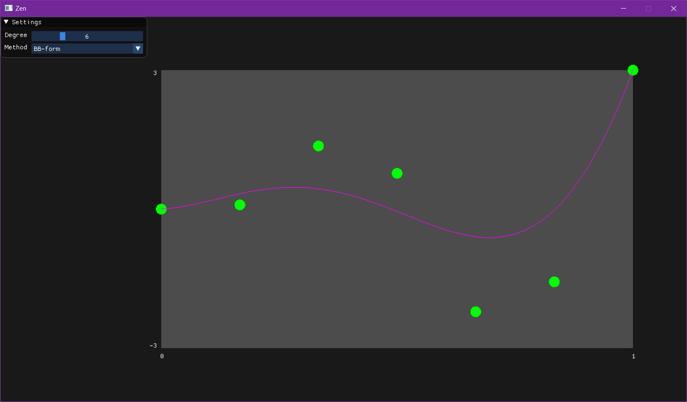

# Build
## Windows
- Install Premake5
- Execute following command on root directory
```batch
premake5 vs2019
```
- Open generated .sln file

# Screenshots

## Deferred Rendering
Implemented in cs300_350 branch


## Bernstein Polynomial Sum
Implemented in curve_graph branch

